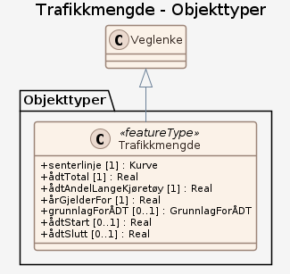

# Produktspesifikasjon: Trafikkmengde

## Generelt om spesifikasjonen

### Unik identifisering

af2c4a0a-1978-4e62-b08d-ed1f36bd5023

#### Fullstendig navn

Trafikkmengde

#### Versjon

2016-02-03

### Referansedato

2026-01-01

### Ansvarlig organisasjon

Statens vegvesen

### Språk

nor

### Hovedtema

Trafikkmengde, Trafikkdata, Veginformasjon, ÅDT, samferdsel, Norge fastland, geodataloven, Det offentlige kartgrunnlaget, Norge digitalt, fellesDatakatalog

### Temakategori

Transport

### Sammendrag

Datasettet gir informasjon om representativ trafikkmengde for en vegstrekning på europa-, riks- eller fylkesveger. Trafikkmengden er beregnet gjennom trafikkdatasystemet, men kan også unntaksvis være subjektivt anslått. Det utgis som et årsdatasett og er sentralt i forvaltning av vegene. Vegnett som har oppstått etter årets ÅDT-beregninger vil kunne mangle data frem til neste års ÅDT-beregning. Datagrunnlaget for ÅDT-beregninger er data fra individuelle målepunkt på vegnettet (trafikkregistreringsstasjoner), disse finnes på <http://trafikkdata.no>

### Formål

Gir informasjon om representativ trafikkmengde for en trafikkstrekning. Kan brukes som grunnlag for ulike analyser der trafikkdata er relevant.

## Spesifikasjonsomfang

**Nivå**: dataset

**Utstrekning**:

- **romlig**:
  - **romlig omfang**: National
  - **bbox**: 2.0, 57.0, 33.0, 72.0
  - **avgrensning**:
    - **vest**: 2.0
    - **sør**: 57.0
    - **øst**: 33.0
    - **nord**: 72.0
    - **crs**: EPSG:25832
- **tidsmessig**: - **intervall**: - 2016-02-03, 2026-01-01

**Juridiske begrensninger**:

- **Bruksbegrensninger**: Ingen begrensninger på bruk er oppgitt.
- **Tilgangsbegrensninger**: Åpne data
- **Bruksbegrensninger**: Lisens
- **Lisens**: Norsk lisens for offentlige data (NLOD)
- **Lisenslenke**: <http://data.norge.no/nlod/no/1.0>
- **Sikkerhetsbegrensninger**: Ugradert

## Innhold og struktur

**Bruk**: Trafikkanalyser, planlegging av veger og andre trafikksikkerhetstiltak, trafikkstøy m.m.

### Datamodell

#### Trafikkmengde

Gir informasjon om representativ trafikkmengde for en strekning

Egenskaper

<table class="feature-attribute-table">
  <colgroup>
    <col style="width: 35%;" />
    <col style="width: 65%;" />
  </colgroup>
  <tbody>
    <tr>
      <th scope="row">Navn:</th>
      <td><strong>senterlinje</strong></td>
    </tr>
    <tr>
      <th scope="row">Definisjon:</th>
      <td>Gir linje/kurve som geometrisk representerer objektet.</td>
    </tr>
    <tr>
      <th scope="row">Multiplisitet:</th>
      <td>1</td>
    </tr>
    <tr>
      <th scope="row">Type:</th>
      <td>Kurve</td>
    </tr>
  </tbody>
</table>

<table class="feature-attribute-table">
  <colgroup>
    <col style="width: 35%;" />
    <col style="width: 65%;" />
  </colgroup>
  <tbody>
    <tr>
      <th scope="row">Navn:</th>
      <td><strong>ådtTotal</strong></td>
    </tr>
    <tr>
      <th scope="row">Definisjon:</th>
      <td>Angir total årsdøgntrafikk.  Representativt for gitt strekning.  Gjennomsnittsverdi.</td>
    </tr>
    <tr>
      <th scope="row">Multiplisitet:</th>
      <td>1</td>
    </tr>
    <tr>
      <th scope="row">Type:</th>
      <td>Real</td>
    </tr>
  </tbody>
</table>

<table class="feature-attribute-table">
  <colgroup>
    <col style="width: 35%;" />
    <col style="width: 65%;" />
  </colgroup>
  <tbody>
    <tr>
      <th scope="row">Navn:</th>
      <td><strong>ådtAndelLangeKjøretøy</strong></td>
    </tr>
    <tr>
      <th scope="row">Definisjon:</th>
      <td>Angir hvor stor andel (i prosent) av kjøretøyene som er definert som lange.  Kjøretøy med lengde større eller lik 5,6 meter defineres som lange kjøretøy.</td>
    </tr>
    <tr>
      <th scope="row">Multiplisitet:</th>
      <td>1</td>
    </tr>
    <tr>
      <th scope="row">Type:</th>
      <td>Real</td>
    </tr>
  </tbody>
</table>

<table class="feature-attribute-table">
  <colgroup>
    <col style="width: 35%;" />
    <col style="width: 65%;" />
  </colgroup>
  <tbody>
    <tr>
      <th scope="row">Navn:</th>
      <td><strong>årGjelderFor</strong></td>
    </tr>
    <tr>
      <th scope="row">Definisjon:</th>
      <td>Angir hvilket år trafikkdataene gjelder for</td>
    </tr>
    <tr>
      <th scope="row">Multiplisitet:</th>
      <td>1</td>
    </tr>
    <tr>
      <th scope="row">Type:</th>
      <td>Real</td>
    </tr>
  </tbody>
</table>

<table class="feature-attribute-table">
  <colgroup>
    <col style="width: 35%;" />
    <col style="width: 65%;" />
  </colgroup>
  <tbody>
    <tr>
      <th scope="row">Navn:</th>
      <td><strong>grunnlagForÅDT</strong></td>
    </tr>
    <tr>
      <th scope="row">Definisjon:</th>
      <td>Angir hva som er grunnlag for ÅDT-verdien</td>
    </tr>
    <tr>
      <th scope="row">Multiplisitet:</th>
      <td>0..1</td>
    </tr>
    <tr>
      <th scope="row">Type:</th>
      <td>GrunnlagForÅDT</td>
    </tr>
    <tr>
      <th scope="row">Tillatte verdier:</th>
      <td>- NorTraf - NorTraf Kommune – Fra NorTraf Kommune - Ferjedatabanken - Telling og skjønn – Basert på telling og skjønn - Skjønn – Basert på skjønn - Vegorama</td>
    </tr>
  </tbody>
</table>

<table class="feature-attribute-table">
  <colgroup>
    <col style="width: 35%;" />
    <col style="width: 65%;" />
  </colgroup>
  <tbody>
    <tr>
      <th scope="row">Navn:</th>
      <td><strong>ådtStart</strong></td>
    </tr>
    <tr>
      <th scope="row">Definisjon:</th>
      <td>Angir årsdøgntrafikk i start av gitt strekning.  Inkl tunge kjøretøy</td>
    </tr>
    <tr>
      <th scope="row">Multiplisitet:</th>
      <td>0..1</td>
    </tr>
    <tr>
      <th scope="row">Type:</th>
      <td>Real</td>
    </tr>
  </tbody>
</table>

<table class="feature-attribute-table">
  <colgroup>
    <col style="width: 35%;" />
    <col style="width: 65%;" />
  </colgroup>
  <tbody>
    <tr>
      <th scope="row">Navn:</th>
      <td><strong>ådtSlutt</strong></td>
    </tr>
    <tr>
      <th scope="row">Definisjon:</th>
      <td>Angir årsdøgntrafikk i slutt av gitt strekning.  Inkl tunge kjøretøy</td>
    </tr>
    <tr>
      <th scope="row">Multiplisitet:</th>
      <td>0..1</td>
    </tr>
    <tr>
      <th scope="row">Type:</th>
      <td>Real</td>
    </tr>
  </tbody>
</table>

Relasjoner

**Arv**
Veglenke

### Kodelister

#### «Enumeration» GrunnlagForÅDT

**Definisjon:** Angir hva som er grunnlag for ÅDT-verdien

Profilparametre i tagged values

<table class="feature-attribute-table">
  <colgroup>
    <col style="width: 35%;" />
    <col style="width: 65%;" />
  </colgroup>
  <tbody>
    <tr>
      <th scope="row">asDictionary</th>
      <td>false</td>
    </tr>
  </tbody>
</table>

Koder

<table class="code-list-table">
  <thead>
    <tr>
      <th>Kodenavn:</th>
      <th>Definisjon:</th>
      <th>Kodeverdi:</th>
    </tr>
  </thead>
  <tbody>
    <tr>
      <td>NorTraf</td>
      <td></td>
      <td></td>
    </tr>
    <tr>
      <td>NorTraf Kommune</td>
      <td>Fra NorTraf Kommune</td>
      <td></td>
    </tr>
    <tr>
      <td>Ferjedatabanken</td>
      <td></td>
      <td></td>
    </tr>
    <tr>
      <td>Telling og skjønn</td>
      <td>Basert på telling og skjønn</td>
      <td></td>
    </tr>
    <tr>
      <td>Skjønn</td>
      <td>Basert på skjønn</td>
      <td></td>
    </tr>
    <tr>
      <td>Vegorama</td>
      <td></td>
      <td></td>
    </tr>
  </tbody>
</table>

## Referansesystem

**Romlige referansesystemer**:

- **kode**: EPSG:25832
  **navn**: EUREF89 UTM sone 32, 2d

- **kode**: EPSG:25833
  **navn**: EUREF89 UTM sone 33, 2d

- **kode**: EPSG:25835
  **navn**: EUREF89 UTM sone 35, 2d

- **kode**: EPSG:3035
  **navn**: EUREF89 / ETRS89-LAEA Europe

- **kode**: EPSG:4258
  **navn**: EUREF 89 Geografisk (ETRS 89) 2d

- **kode**: EPSG:25832
  **navn**: EUREF89 UTM sone 32, 2d

**Romlig representasjonstype**: Vektor

## Kvalitet

**Nivå**: dataset

- **navn**: SOSI-produktspesifikasjon: Trafikkmengde
  **Måleparameter**: Dataene er i henhold til produktspesifikasjonen

- **navn**: Sosi applikasjonsskjema
  **Måleparameter**: SOSI-filer er i henhold til applikasjonsskjema

- **navn**: Sosi applikasjonsskjema
  **Måleparameter**: GML-filer er i henhold til applikasjonsskjema

- **navn**: Prosentvis oppfyllelse av FAIR-prinsipper
  **Måleparameter**: Angir fullstendighet i forhold til krav fra FAIR-prinsippene (The FAIR Guiding Principles for scientific data management and stewardship)
  **Resultat**: 91

- **navn**: FAIR
  **Resultat**: Prosentvis oppfyllelse av FAIR-prinsipper: 91%

**Beskrivelse**:
Nasjonal vegdatabank (NVDB) tilbyr samkjøring av data fra mange kilder. Samkjøringen tillater at veg- og trafikkdata kan presenteres på kartbakgrunn og analyseres sammen med data fra andre etater. Statens vegvesen er kjent med at kvaliteten på data som tilbys gjennom samkjøringen kan være varierende. Det arbeides kontinuerlig med kvalitetsforbedring og oppdatering av datagrunnlaget. Statens vegvesen kan derfor ikke garantere at datagrunnlaget til enhver tid er riktig og således heller ikke på ta seg ansvar for resultater som skyldes feil i datagrunnlaget. 

Statens vegvesen har ikke noe ansvar for nøyaktighet, pålitelighet, eller fullstendighet for informasjon og kart tilgjengeliggjort. Statens vegvesen har heller ikke noe ansvar for følgeskader som skyldes bruk av informasjonen eller tekniske avbrudd i tjenesten.

## Datavedlikehold

**Vedlikeholdsfrekvens**: Årlig

**Vedlikeholdsnotat**: Trafikkanalyser, planlegging av veger og andre trafikksikkerhetstiltak, trafikkstøy m.m.

**Status**: Fullført

## Presentasjon

**Tegnforklaring**:
<https://register.geonorge.no/register/versjoner/tegneregler/statens-vegvesen/trafikkmengde>

## Leveranse

**Distribusjoner**:

- **format**: - **format**: GEONORGE:DOWNLOAD
  **tilgang**:

  - **lenke**: <https://nedlasting.geonorge.no/api/capabilities/>
  - **protokoll**: GEONORGE:DOWNLOAD

- **tittel**: Geonorge nedlastning
  **format**: - **format**: Geonorge nedlastning
  **tilgang**:

  - **lenke**: <https://nedlasting.geonorge.no/api/capabilities/>
  - **protokoll**: GEONORGE:DOWNLOAD

## Metadata

**Standard**: ISO19115

**Standardversjon**: 2003

**Metadatadato**: 2026-03-06

**språk**: nor

**Kontaktpunkt**:

- **organisasjon**: Statens vegvesen
- **epost**: espen.sveen@vegvesen.no
- **rolle**: pointOfContact

**Identifikatorer**:

- **Utsteder**: geonorge
  **kode**: af2c4a0a-1978-4e62-b08d-ed1f36bd5023

**Metadatalenke**:
<https://www.geonorge.no/geonetwork/srv/nor/csw?service=CSW&request=GetRecordById&version=2.0.2&outputSchema=http://www.isotc211.org/2005/gmd&elementSetName=full&id=af2c4a0a-1978-4e62-b08d-ed1f36bd5023>
